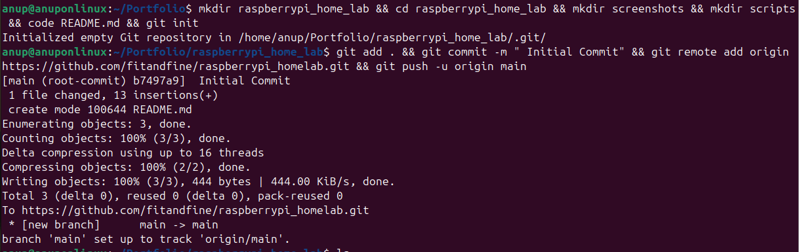
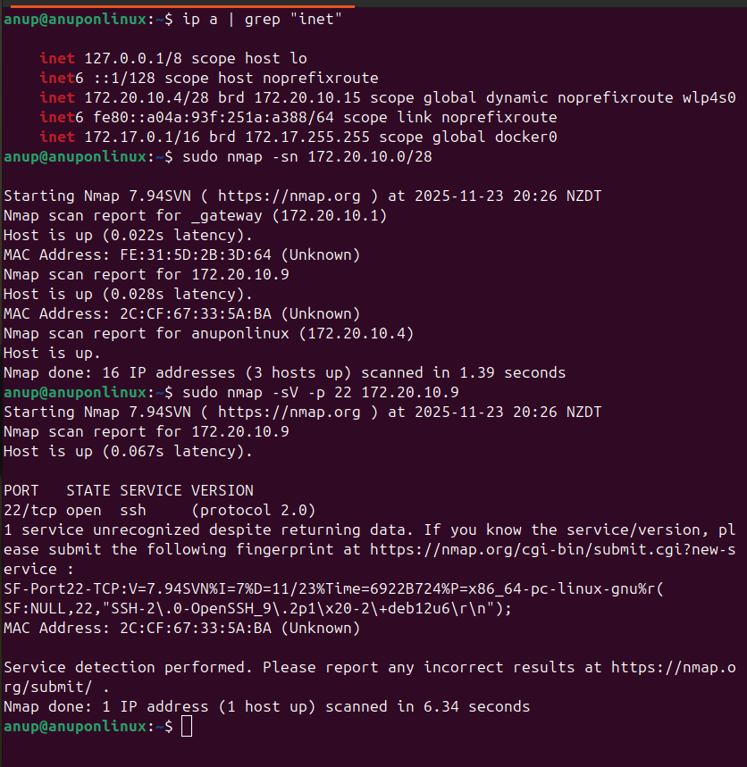
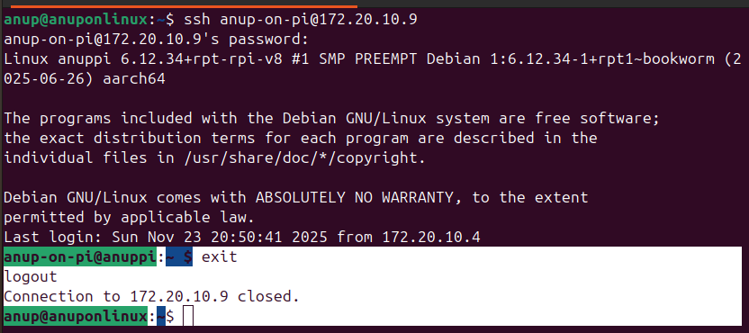
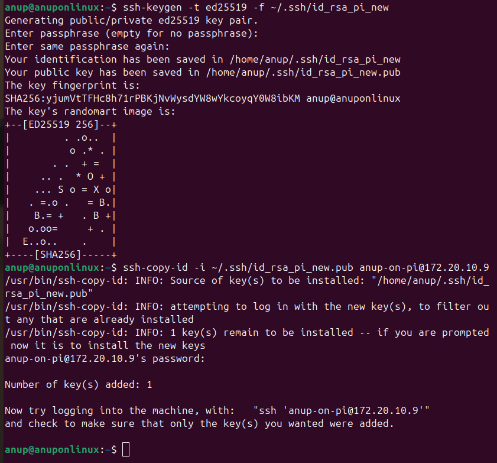
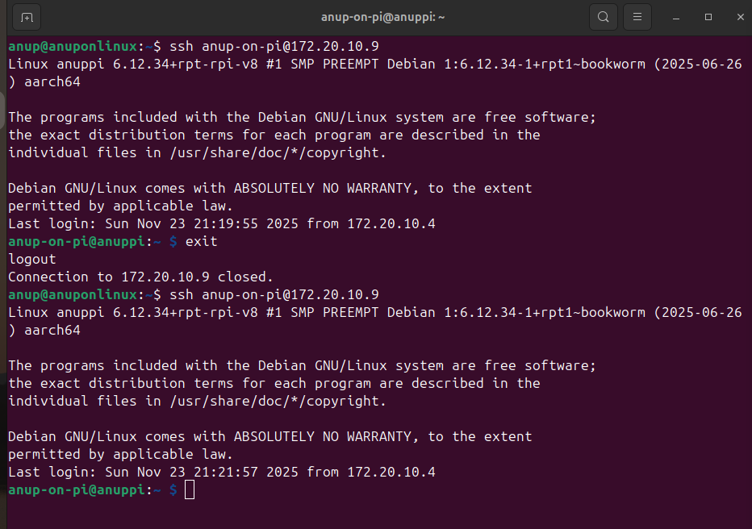
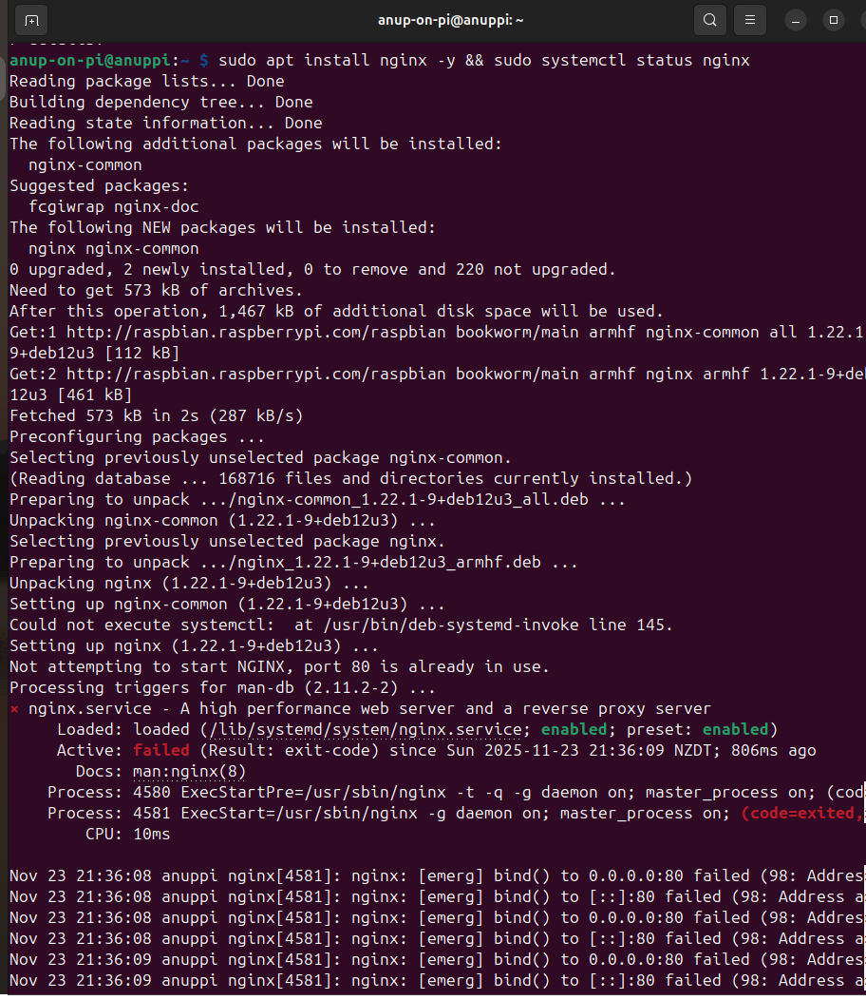
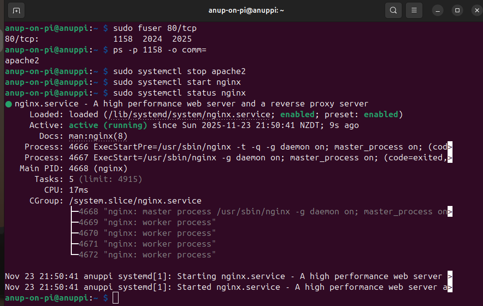

# RaspberryPi Home Lab

This project documents the setup and configuration of a personal Raspberry Pi used as a foundational home lab server. The primary objective is to gain practical, hands-on experience with fundamental DevOps principles, including secure remote access, network configuration, web server deployment, and service automation in a Linux environment.

### This documentation serves as a practical blueprint, demonstrating comfort with Linux command-line tools, networking fundamentals (Nmap), system services (systemctl), and scripting for basic automation.

## Project Goals:
**Infrastructure Management:** Successfully discover, connect to, and manage a headless Raspberry Pi over a local network.

**Security & Access:** Implement robust, non-password-based SSH authentication using key pairs for secure administrative access.

**Web Services:** Deploy and manage the high-performance Nginx web server to serve content.


**Automation:** Utilize Bash scripting and Linux utilities (inotifywait, systemctl, curl) to automate service health checks and configuration management, ensuring high availability and operational efficiency.


### Project Folders & git initialization
```bash
$ mkdir raspberrypi_home_lab && cd raspberrypi_home_lab && mkdir screenshots && mkdir scripts && code README.md && git init
```
## Connect Local git to github repository

```bash
$ git add . && git commit -m " Initial Commit" && git remote add origin https://github.com/fitandfine/raspberrypi_homelab.git && git push -u origin main
```



## Problem unknown raspberry Pi IP address:
When running a Raspberry Pi in headless mode (no keyboard, mouse, or monitor), the only way to access it is over the network via SSH.
But when your Raspberry Pi is connected through an iPhone hotspot, the hotspot UI does not show connected device IP addresses.
This makes it impossible to know the Pi’s IP directly.

**Solution:**
**nmap ( Network Mapper)**

**nmap** is a network exploration tool that scans an IP range and reports devices, open ports, and system fingerprints.
It works by sending raw IP packets to target hosts and then analyzes the responses to determine:

1. Host Status: Are the target hosts up and running?

2. Open Ports: What ports are open on the host?

3. Service/Version: What services (e.g., SSH, HTTP, FTP) are running on those ports, and what versions are they?

4. OS Detection: What operating system and version is the target running?

### In this case, we need it to:

1. Detect all devices connected to the iPhone hotspot.

2. Identify the Raspberry Pi based on open ports. (SSH → port 22)

3. Obtain the Pi’s IPv4 address so we can SSH into it.

##  Network Reconnaissance: Locating the Raspberry Pi

This section details the logical process used to determine the IP address of the headless Raspberry Pi through network scanning, a crucial step in managing remote infrastructure. 

---

### Step 1: Identify the Local Subnet

The **`ip a | grep "inet"`** command was used to identify the local network interface and its assigned IP address.

| Command & Output | Explanation |
| :--- | :--- |
| **ip a  grep "inet"**| Displays network configuration filtered for IPv4 (`inet`) addresses. |
| **`inet 172.20.10.4/28 ... wlp4s0`** | This line identifies the laptop's IP as **$172.20.10.4$** on the wireless interface (`wlp4s0`). The **`/28`** CIDR notation defines the network subnet to be scanned: **$172.20.10.0$** through $172.20.10.15$. |

---

### Step 2: Host Discovery and Logical Elimination

The **`sudo nmap -sn 172.20.10.0/28`** command performed a **Ping Scan** (`-sn`) on the entire subnet to find all active devices.

| Nmap Report for $172.20.10.0/28$ | Role | Logic for Elimination |
| :--- | :--- | :--- |
| **$172.20.10.1$** (`_gateway`) | **Router** | Eliminated: This is the network gateway. |
| **$172.20.10.4$** (`anuponlinux`) | **Laptop** | Eliminated: This is the scanning machine itself. |
| **$172.20.10.9$** | **Unknown Host** | **Deduced Target:** By eliminating the router and the laptop, the remaining active host, **$172.20.10.9$**, must be the Raspberry Pi. |

---

### Step 3: Service Verification (Final Confirmation)

To definitively prove that $172.20.10.9$ is a Linux server ready for remote access, a targeted scan was performed.

| Command & Output | Verification Logic |
| :--- | :--- |
| **`sudo nmap -sV -p 22 172.20.10.9`** | **`-p 22`** focuses the scan on the SSH port, and **`-sV`** attempts to detect the running service version. |
| `PORT 22/tcp open ssh` | Confirms the required **Secure Shell (SSH)** service is listening. |
| `OpenSSH_9.2p1 -2+deb12u6` | The service banner explicitly identifies the operating system as a **Debian-based** distribution (which includes Raspberry Pi OS), confirming the host is the Pi. |

**Thus,** through logical elimination and service banner confirmation, the Raspberry Pi's IP address was successfully identified as **$172.20.10.9$**. This prepares us for the next phase of establishing a secure connection.



## Connecting Raspberry PI with ssh:
Enter the following command <user_name>@ip_address, and you will be prompted for password or linux on raspberry pi. 
```bash
$ ssh anup-on-pi@172.20.10.9
```


Now terminate the ssh session with exit command and create key-pair login between laptop and raspberry pi before installing nginx.
-----

##  Why Key-Pair Authentication is Necessary

While password login is simple, it poses significant security and operational problems. SSH key-pair authentication solves these issues, making it the standard practice in professional infrastructure management.

| Feature | Password Authentication | Key-Pair Authentication | Necessity for Project Scope |
| :--- | :--- | :--- | :--- |
| **Security** | Susceptible to **Brute-Force Attacks** and dictionary attacks. Weak passwords are a single point of failure. | Uses strong, 2048-bit or higher cryptographic keys that are virtually impossible to crack. | **Mandatory** for security best practices.|
| **Automation** | Requires a manual prompt for a password or saving passwords in script files (a major security risk). | Allows for **non-interactive login**. Scripts (like the health checks we'll write) can run seamlessly without human intervention. | **Mandatory** for the "Automation" goals of this project. |
| **User Experience**| Requires typing a password on every login. | If using an SSH agent, allows instant, one-click access after an initial one-time passphrase entry. | **Improves efficiency** and reflects a professional workflow. |

-----

## Generating and Deploying a Dedicated SSH Key

Let's create a **new, dedicated key** (`id_rsa_pi_new`).

### Step 1: Generate the New Key Pair (Laptop)

This command creates a new private key (`id_rsa_pi_new`) and its corresponding public key (`id_rsa_pi_new.pub`).

```bash
# Command: Generate a new SSH key pair using the modern Ed25519 algorithm.
# -f specifies a unique filename to prevent overwriting existing key.
$ ssh-keygen -t ed25519 -f ~/.ssh/id_rsa_pi_new
```

  * **Prompt:** You will be prompted to enter a **passphrase**. This passphrase protects the private key on your laptop and is the password you will be asked for *by the laptop* when you connect, not the Pi's password.

### Step 2: Copy the Public Key to the Raspberry Pi (from Laptop)

The `ssh-copy-id` utility securely places the public key (`id_rsa_pi_new.pub`) into the correct location on the Pi (`~/.ssh/authorized_keys`).

```bash
# Command: Upload the new public key to the Pi.
# You will be prompted for the Raspberry Pi's USER PASSWORD one last time.
$ ssh-copy-id -i ~/.ssh/id_rsa_pi_new.pub anup-on-pi@172.20.10.9
```

### Step 3: Test the Key-Based Login (Laptop)

Now, attempt to connect to the Raspberry Pi using same ssh command. This will prompt you for yout laptop's password once. Then it will not prompt for it till you log out or reboot the laptop.

```bash
# Command: Connect using the new key file.
# You will be prompted for the KEY'S PASSPHRASE (if set), not the Pi's password.
$ ssh anup-on-pi@172.20.10.9
```

  * **Result:** Successful login without needing the Pi's user password confirms the secure key-based authentication is fully operational.

  


The infrastructure access is now secure and automated. 

-----
## Installing Nginx server on raspberry Pi
```bash
$ sudo apt update
$ sudo apt install nginx -y && sudo systemctl status nginx
```

## Oh My Holiest of GODs, ERROR !!

What happened here is a classic port conflict error. While Nginx installed successfully, it failed to start because another program was already using its required default port, TCP port 80.

```bash
# Command: Finds the Process ID (PID) using TCP port 80.
# The `fuser` utility is highly effective for this task.
$ sudo fuser 80/tcp # shows which process id is using the port 80
$ ps -p 1158 -o comm= # in this case it was the process id number 1158
$ sudo systemctl stop apache2 # process id 1158 happened to be apache2
$ sudo systemctl start nginx # nginx now started after freeing port 80 from apache2
$ sudo systemctl status nginx # shows the status of nginx ( see screenshot below)
```

