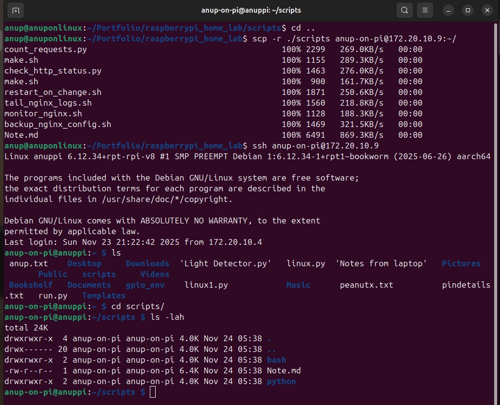
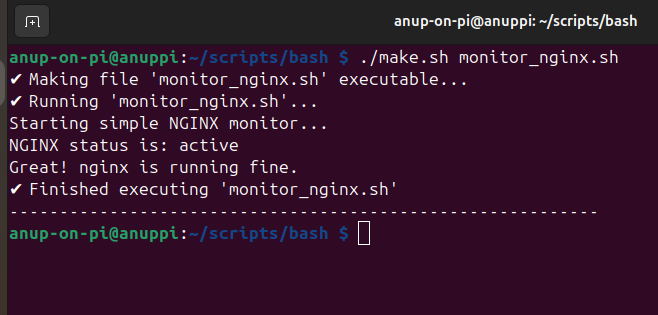
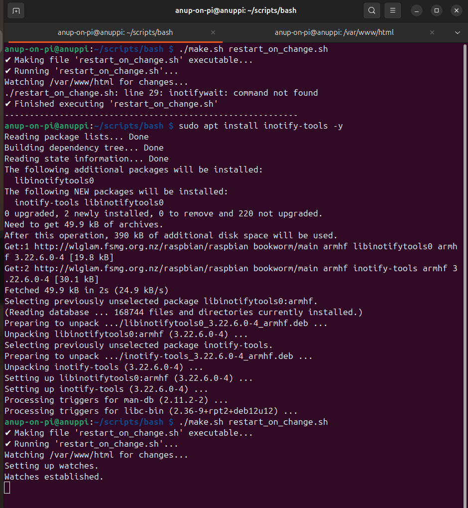

#  **Automation Notes — Raspberry Pi Home Lab**

This file explains the automation scripts I wrote as part of my Raspberry Pi + Nginx home lab project.
These scripts live inside the `scripts/bash/` and `scripts/python/` directories.

I wrote them mainly to teach myself how system services, logging, file monitoring, and HTTP checks work on a real Linux server — especially because my Raspberry Pi runs headless and everything must be done remotely over SSH via my only available network infrastructure, iPhone's HotSpot.

Each script is described below with:

* **Why I wrote it**
* **What it automates**
* **Key Linux / Bash / Python concepts used**
* **Things I had to learn to make it work**

---
# **How I Run These Scripts on the Raspberry Pi**
I used `scp` to copy folder from laptop to raspberry pi. However, it could also be done by cloning this github repository in raspberry pi. 
### What is scp?
**scp** stands for `Secure Copy Protocol`. It is a network protocol used to securely transfer files between a local host and a remote host, or between two remote hosts.
#### Key Features and Why You Should Use It:
* **Security:** This is the primary reason. scp uses the SSH (Secure Shell) protocol for data transfer and authentication. This means all data, including your files, username, and password, are encrypted during the transfer process, making it highly secure against network snooping.

* **Simplicity:** It uses a familiar command-line interface, making it quick to integrate into scripts or use for one-off transfers.

* **Portability:** It's installed by default on nearly every Unix-like operating system (Linux, macOS, and usually available on Windows via PowerShell/WSL).

* **No Server Needed:** Unlike FTP or web transfers, you don't need to set up a separate file transfer server on the destination machine; as long as SSH is running (which it is by default on Raspberry Pi OS), scp works.

```bash
$ scp -r ./scripts anup-on-pi@172.20.10.9:~/  # ~/ is shorthand for /home/anup-on-pi/
```
Output:
```output
count_requests.py                                        100% 2299   269.0KB/s   00:00    
make.sh                                                  100% 1155   289.3KB/s   00:00    
check_http_status.py                                     100% 1463   276.0KB/s   00:00    
make.sh                                                  100%  900   161.7KB/s   00:00    
restart_on_change.sh                                     100% 1871   250.6KB/s   00:00    
tail_nginx_logs.sh                                       100% 1560   218.8KB/s   00:00    
monitor_nginx.sh                                         100% 1128   188.3KB/s   00:00    
backup_nginx_config.sh                                   100% 1469   321.5KB/s   00:00    
Note.md                                                  100% 6491   869.3KB/s   00:00   
```
Then ssh into the raspberry pi:
```bash
$ ssh anup-on-pi@172.20.10.9
$ ls # scripts folder can be seen in the home directory of raspberry pi
$ cd scripts && cd bash # navigates to /home/scripts/bash folder
```




My Pi is **headless**, so everything goes through SSH.

# **BASH SCRIPTS**

---

## 1. `monitor_nginx.sh`

```bash
anup-on-pi@anuppi:~/scripts/bash $ ./make.sh monitor_nginx.sh 
```
This one checks if Nginx is actually running, and if not, tries to start it.

### **What this script does**

* Uses `systemctl is-active nginx` to check current service status.
* If the output isn't `"active"`, it tries to start Nginx.
* Prints out both the old and new status so I can see what happened.

### **Technical notes & things I learned**

* **`systemctl is-active`** returns just one word (`active`, `inactive`, `failed`), unlike the full `systemctl status` output.
  Really handy for automation scripting.
* **Exit codes** (`$?`) tell you whether a command succeeded (0) or failed (non-zero).
* Restarting Nginx blindly can break things — so this is just a "lightweight" health check.
* This became the script I run the most, because it's fast and tells me exactly what's going on.



## 2. `restart_on_change.sh`

This script watches `/var/www/html` and restarts Nginx only when something inside that folder changes.

### **What it automates**

* File change detection using `inotifywait`
* Running an Nginx config test before restarting (`nginx -t`)
* Restarting Nginx **only** when it's safe

### **Technical concepts used**

* **inotifywait** (from `inotify-tools`):
  Lets the script "listen" for filesystem events like:

  * modify
  * create
  * delete
    I didn’t know Linux even had this built-in event system until I made this script.
* **Pipes (`|`)**:
  Sending the event stream into a `while read` loop so the script reacts live.
* **`nginx -t`**:
  This tests configuration syntax and prints errors.

  **`Super important`** — if the test fails and you restart anyway, the web server won’t come back online.

### **Why I wrote it**

I kept editing `index.html` while experimenting with Nginx and wanted something that reloads the server without thinking about it.



## 3. `backup_nginx_config.sh`

This script creates timestamped backups of `/etc/nginx`.

### **Why it exists**

I broke my Nginx config multiple times while learning, and restoring manually was painful.
So I wrote a simple backup script.

### **How it works**

* Creates `~/nginx_backups` if it doesn’t exist (`mkdir -p`).
* Copies the entire `/etc/nginx` directory.
* Names each backup like:

```
nginx-backup-2025-11-21-14-35-59
```

### **Key concepts**

* **`mkdir -p`**: creates directory only if missing
* **`cp -r`**: recursive copy (copies folder + contents)
* **`$(date +format)`**: embedding timestamps into filenames
* Understanding that `/etc/nginx/` contains:

  * `nginx.conf`
  * site configs
  * SSL directories
  * module configs
    …so backing up the whole folder is safer.

---

## 4. `tail_nginx_logs.sh`

This script tails both Nginx logs together so I can see real-time traffic and errors in one terminal.

### **What it does**

* Follows (`tail -f`) both:

  * `/var/log/nginx/access.log`
  * `/var/log/nginx/error.log`
* Prints them together so I don’t have to open two terminals.

### **Technical things I learned**

* `tail -f` streams logs continuously.
* Passing two files to `tail` will combine output — I didn’t actually know this worked until I tried.
* Useful for debugging:

  * 404s appear in access log
  * 500 errors appear in error log
  * seeing both at once helps correlate events

---

# **PYTHON SCRIPTS**

---

## 1. `check_http_status.py`

This is a tiny Python script that sends a GET request to my Nginx homepage and prints the status code.

### **Why I wrote it**

I wanted a quick way to confirm whether the web server was responding without opening a browser.

### **What it does**

* Uses the `requests` library to send `GET http://localhost`
* Prints HTTP status codes (e.g., 200, 404, 500)
* Prints a preview of the page body

### **Technical notes**

* `requests.get()` is much easier than Python’s built-in `urllib` for HTTP calls.
* A failed connection throws an exception, so I wrapped everything in `try/except`.
* Great for scripting uptime checks or cron jobs later.

---

## 2. `count_requests.py`

This script counts how many HTTP requests Nginx has served by counting the number of lines in `access.log`.

### **How it works**

* Opens `/var/log/nginx/access.log`
* Reads it line by line
* Increments a counter for each line
* Prints the total number of requests

### **Things I learned**

* Each entry in `access.log` is one complete HTTP request.
* Log parsing is incredibly common in operations work.
* Simple scripts like this can be turned into:

  * traffic dashboards
  * alerting checks
  * rate monitoring tools

---

#  **The Utility Runner — make.sh**

The `make.sh` script sits in both the bash and python directories.
I wrote it because I kept forgetting to run:

```
chmod +x script.sh
```

and scripts failed silently without execute permissions.

### **What make.sh does**

* Takes a script name as an argument
* Checks if it exists
* Makes it executable (`chmod +x`)
* Executes it directly (`./script`)

### **Why it helps**

It gives me a consistent, simple way to run any script without thinking about permissions.

Example:

```bash
./make.sh monitor_nginx.sh
```

Or for Python:

```bash
./make.sh count_requests.py
```

Since Python scripts also start with a **shebang line**, they execute the same way as Bash scripts.

---


##  **Closing Notes**

All these scripts were written to help me understand:

* how Linux services behave
* how web servers restart
* how logs work
* how to automate tasks safely
* how to structure a tiny ops toolkit for a real server

Nothing here is over-engineered. I have tried my level best to write comments in the script files to not surprise myself in future a.k.a maintainability.
